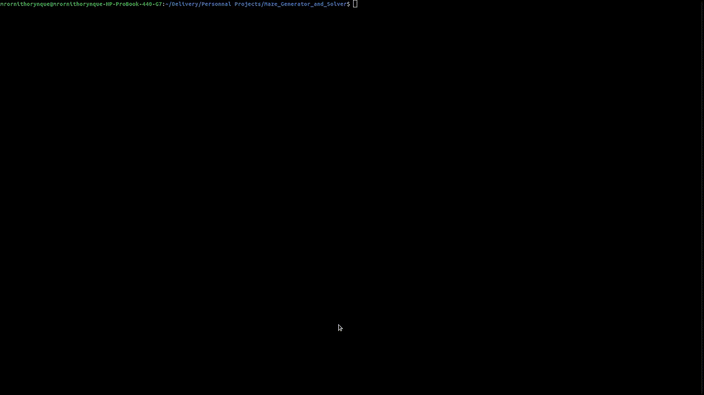

#
# Maze_Generator_and_Solver
Here is a little program which generates mazes and solves them.
#
# How to use 
> make

Two binaries will show up on their respective folder (generator and solver).

To execute generator :
> ./generator lines cols perfect

Lines and cols are your two numbers to create your maze (don't go more than 100 * 100, it's beginning to be kinda slow).
And the perfect argument is optional. It's to create a perfect maze which has no loops and no clusters.

To execute solver :
> ./solver filepath

Filepath is the path of your maze.
#
# Reminder
This project was made on linux with Ncurses library (I'm working on a little more enjoyable experience to watch the program working).
be sure that you have downloaded the library before anything : https://www.cyberciti.biz/faq/linux-install-ncurses-library-headers-on-debian-ubuntu-centos-fedora/
